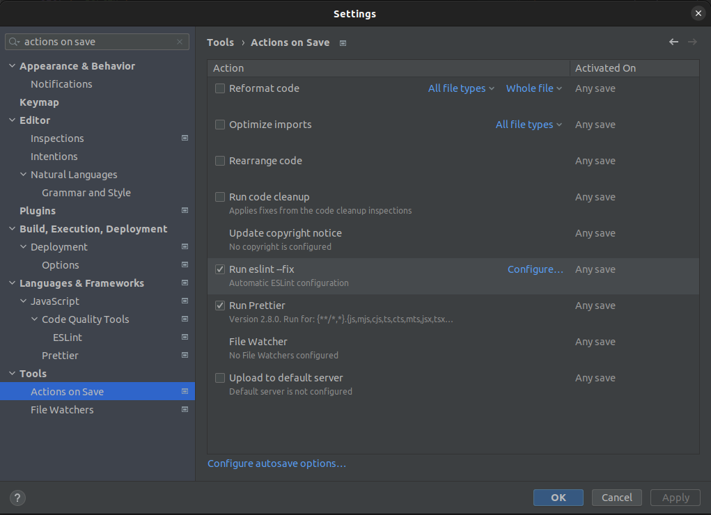
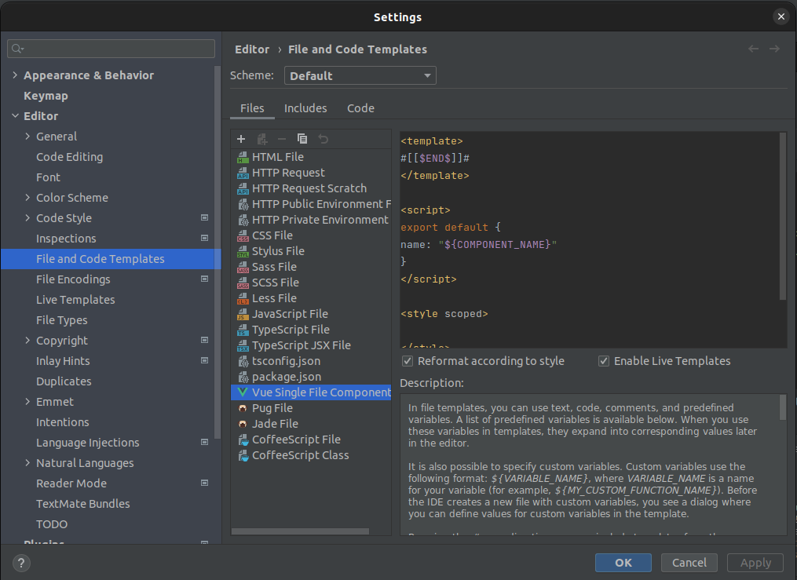

# TDD Workshop Repository

## Voraussetzung und Setup

Dieses Projekt braucht Node v18 oder neuer.

Um das Projekt zu initialisieren und zu prüfen, bitte folgendes ausführen:

- `npm install` im Rootverzeichnis ausführen
- `npm run build` im Rootverzeichnis ausführen
- Die folgende Run-Configs im IDE verwenden:
  - `vitest` startet die Unit-Tests des Frontends (einmalig).
    Alle Tests sollten grün sein, für die Übungen sind allerdings viele Tests noch deaktiviert.
  - `vitest --watch` startet die Unit-Tests des Frontends und führt sie automatisch bei Änderungen neu aus.
    Das ist die für die Übungen die empfohlene Vorgehensweise.
  - `Start (dev)` startet alles, was für das Übungsprojekt notwendig ist (d.h. frontend, backend, Mailhog).
    Dies sollte keinen Fehler ausgeben.
    Die Anwendung ist dann auf http://localhost:8080 erreichbar.
    Falls Mailhog nicht über die IDE-Integration mit Docker funktioniert, kann es auch manuell
    per `docker run -d -p 1025:1025 -p 8025:8025 mailhog/mailhog` gestartet werden.
  - `test:e2e` testet die Oberfläche mit Playwright.
    Alle Tests sollten grün sein.
    Falls der Runner sagt, dass gewisse Dependencies fehlen, diese installieren.
- Wenn die vorherigen Schritte fehlerfrei laufen, funktioniert alles.
  Glückwunsch :)

## Services und Ports

| Service  | Beschreibung                                                                                                       | Adresse                                                                                           |
| -------- | ------------------------------------------------------------------------------------------------------------------ | ------------------------------------------------------------------------------------------------- |
| frontend | Liefert die Oberfläche der Demo-Anwendung aus, braucht zum "normalen" funktionieren ein Backend.                   | http://localhost:8080/                                                                            |
| backend  | Stellt die Daten für das Frontend bereit. Minimale Node.js Anwendung und muss für den Kurs nicht angepasst werden. | http://localhost:8081/ (und wird vom Frontend unter http://localhost:8080/api/ verfügbar gemacht) |
| Mailhog  | Mailserver für Tests, der es einfacht macht, gesendete Mails abzufragen.                                           | WEB-UI: http://localhost:8025/ <br> SMTP: http://localhost:1025/                                  |

## Inhalt

- `backend` enthält ein Node-basiertes Backend. Das Backend wird nur gestartet und muss nicht geändert werden.
- `commons` enthält Dateien, die sowohl im Backend als auch im Frontend verwendet werden. Es wird nur einmalig gebaut
  und muss nicht geändert werden.
- `docs` enthält Resourcen und die Übungsanleitungen
- `frontend-vue` enthält den Frontend-Code. **Nur hier wird während der Schulung entwickelt.**

### Liste der Übungen

- Tag 1: TDD mit Jest und Unit-Testing
  - [Übung 1: Unit-Testing mit Jest](./docs/Uebung_1.md)
  - [Übung 2: Vue Komponente Unit-Testing](./docs/Uebung_2.md)
  - [Übung 3: Test Isolation und Server Interaktion](./docs/Uebung_3.md)
  - [Übung 4: Refactoring und Komponenten-Design](./docs/Uebung_4.md)
- Tag 2: UI Testing
  - [Übung 5: Playwright und Page-Objects Pattern](./docs/Uebung_5.md)
  - [Übung 6: E2E Testing](./docs/Uebung_6.md)
  - [Übung 7: Akzeptanztests mit Cucumber](./docs/Uebung_7.md)

## IDE Einstellungen (IntelliJ, Webstorm)

### Reformat und ESLint/Prettier on Save

Für eine optimale Entwicklung sollte man gewisse Aktionen beim Speichern aktivieren:



### Vue File Template

Wir verwenden die Composition-API mit der `<script setup>` Syntax. Standardmäßig nutzt aber IntelliJ/Webstorm die
Options API. Ansonsten wollen wir TypeScript Code schreiben.



Im Template einfach diesen Code einfügen:

```vue
<template>#[[$END$]]#</template>

<script lang="ts" setup></script>

<style scoped></style>
```
